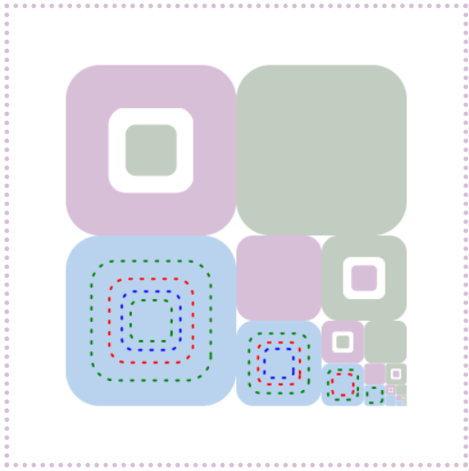

# canvasZone
canvas绘制 基于zone更方便绘制。  
在canvas绘制中一个粗略的想法，依靠一个zone的scale，move ，stroke
和循环来简化一些绘制。   
意图通过一个链式来实现一些绘制，不好用而且感觉效率挺低的。 
## 一点点示例
```javascript
var canvas=document.getElementById("mainCanvas");
var ctx=canvas.getContext('2d');
var allZone=new zone({ //生成一个zone 区域
    ctx:ctx,
    zone:[50,50,300,300],
    radius:0.2
});
var dottedLine={
    lineWidth:2,
    setLineDash:[2,8],
    lineJoin:"round",
    lineCap:"round"
};
var color=["green","red","blue"];
function stroke(now,i){
    return now.scale(0.7).stroke(color[i%3],dottedLine);
}
//链式  循环 now是当前的zone i是循环的次数
function draw(now,i){
    var all=now.scale(1,"center",1);
    var first=all.getZone(0,0,0.5,0.5).fill("thistle");
    if(i%2==0)first.scale(0.5,"center",1)
    .clear().scale(0.6,"center",1)
    .fill("#C1CDC1").exit().exit();
    var second=first.moveX("1").fill("#C1CDC1");
    if(i%2==1)second.scale(0.5,"center",1)
    .clear().scale(0.6,"center",1)
    .fill("thistle").exit().exit();
    var third=second.move("-1","1").fill("#B9D3EE");
    third.copy().repeat(Math.max(4-i,0),stroke);
    var fourth=third.moveX("1");
    return fourth;
}
//把draw里面的绘制过程循环10次
allZone.repeat(10,draw);
```
## 绘制效果

